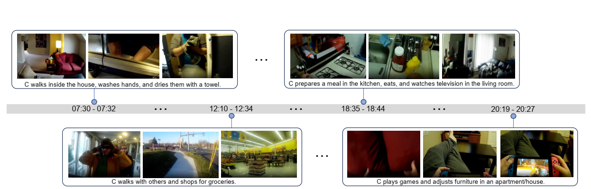

# 👓 X-LeBench: A Benchmark for Extremely Long Egocentric Video Understanding

<p align="center">
  <a href="https://arxiv.org/abs/2501.06835" target='_blank'>
    
  </a>
  <a href="https://huggingface.co/datasets/VvV7/X-LeBench" target='_blank'>
    
  </a>
  <a href="https://github.io/" target='_blank'>
    
  </a>
</p>

X-LeBench is a novel benchmark and dataset specifically crafted for evaluating tasks on extremely long egocentric video recordings, containing video life logs consist of multiple videos with corresponding timestamps.
 
## 🚨 Before You Use the Code
Please refer to our [paper](https://arxiv.org/abs/2501.06835) and [project page](https://your-project-page.com) for details on task definitions and usage guidelines.

📥 To get started:
- Download the **video data** from [Ego4D](https://ego4d-data.org/docs/start-here/)
- Download simulation and annotation `.json` files from our [HuggingFace dataset page](https://huggingface.co/datasets/VvV7/X-LeBench)

## 🔍 Highlights
- 🎫 **Life-logging Simulation Pipeline**: a novel and customizable pipeline that simulates realistic, ultra-long egocentric video life logs by integrating synthetic daily plans with real-world footages (from [Ego4D](https://ego4d-data.org/docs/start-here/)).
- 🎞️ **Dataset**: 432 extremely long video life-log simulations of varying lengths.
- 📖 **Benchmark Tasks**: 4 daily activity related tasks consisting of 8 subtasks.


## 📂 Code Structure
```bash
X-LeBench/
│── assets/                # Images and shared visual assets
│── generation/            # Life-logging simulation pipeline implementation
│── README.md              # Project entry and setup instructions
```

## 📢 Citation

If you use X-LeBench in your research, please cite our work:

```bibtex
@misc{zhou2025xlebenchbenchmarkextremelylong,
      title={X-LeBench: A Benchmark for Extremely Long Egocentric Video Understanding}, 
      author={Wenqi Zhou and Kai Cao and Hao Zheng and Xinyi Zheng and Miao Liu and Per Ola Kristensson and Walterio Mayol-Cuevas and Fan Zhang and Weizhe Lin and Junxiao Shen},
      year={2025},
      eprint={2501.06835},
      archivePrefix={arXiv},
      primaryClass={cs.CV},
      url={https://arxiv.org/abs/2501.06835}, 
}
```

And please also cite Ego4D for their landmark contributions!
```bibtex
@inproceedings{grauman2022ego4d,
  title={Ego4d: Around the world in 3,000 hours of egocentric video},
  author={Grauman, Kristen and Westbury, Andrew and Byrne, Eugene and Chavis, Zachary and Furnari, Antonino and Girdhar, Rohit and Hamburger, Jackson and Jiang, Hao and Liu, Miao and Liu, Xingyu and others},
  booktitle={Proceedings of the IEEE/CVF conference on computer vision and pattern recognition},
  pages={18995--19012},
  year={2022}
}
```
## 📝 License

This project is licensed under the MIT License. See the [LICENSE](LICENSE) file for details.
