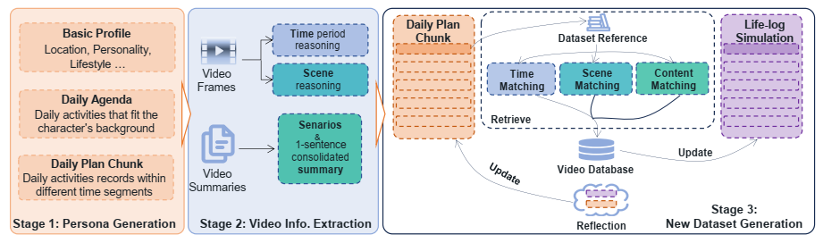

# 🎫 Life-Logging Simulation Pipeline

This module implements the simulation pipeline for generating **diverse egocentric video life logs**, structured into 3 stages. You can easily customize and execute the full simulation by editing `config.py` and running `main.py`. See more details in our [paper](https://arxiv.org/abs/2501.06835).

---

## 📌 Overview of the Pipeline

The simulation includes **three stages**:
 
Code structure is shown below:
```bash
generation/
│── assets/                     # Images and shared visual assets
├── ego4d_info/                 # Video data extracted from Ego4D (Stage 2)
├── prompt_template/            # Prompt templates for generation
├── utils/                      # Helper functions
├── config.py                   # Configuration file
├── gen_persona.py              # Stage 1: Persona profile generation
├── gen_daily_plan.py           # Stage 1: Daily agenda generation
├── gen_chunked_daily_plan.py   # Stage 1: Fine-grained plan chunking
├── retrieve_video.py           # Stage 3: Video retrieval by matching
├── main.py                     # Entry point: full simulation pipeline
├── README.md                   # This file
```

### ✅ Stage 1: Daily Plan & Persona Generation
Generates diverse **persona profiles** and **daily activity plans**.

- `gen_persona.py`: Creates distinct personas with attributes (e.g., lifestyles, personalities).
- `gen_daily_plan.py`: Builds high-level agendas for each persona.
- `gen_chunked_daily_plan.py`: Breaks down plans into fine-grained activity chunks.

### ✅ Stage 2: Ego4D Video Information Extraction
Extracts and inference video information from **Ego4D** dataset to construct the **video selection library**.

- `ego4d_info/`: Stores parsed video data and indexing info.
- `ego4d_info/creat_ego4d_db.py`: Stores video data using chromadb.
- Utilized in later stages for relevant video retrieval.

### ✅ Stage 3: Video Retrieval & Simulation
Matches plan chunks to suitable videos.

- `retrieve_video.py`: Implements the matching logic to simulate lifelog videos.
- Output includes videos aligned with generated plans.

---

## ⚙️ Configuration

All global settings (paths, model settings, API keys, etc.) are defined in:

- `config.py`

Modify this file as needed to:
- Set data paths
- Adjust generation parameters
- Switch between models

---

## 🚀 Run the Simulation

Once configured, simply run:

```bash
python main.py
```
